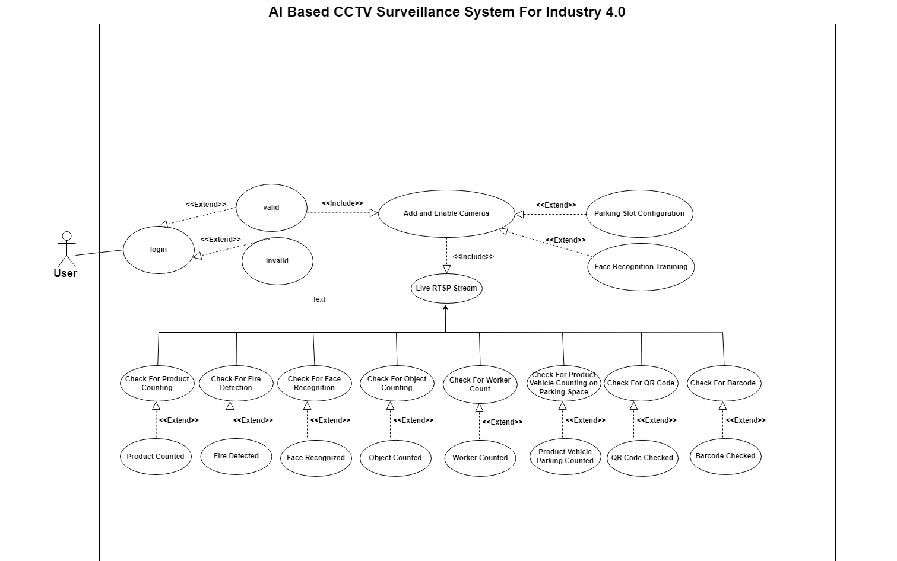
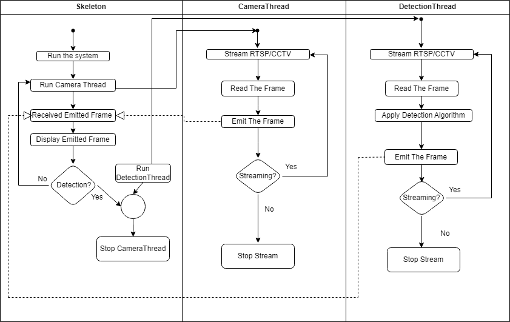
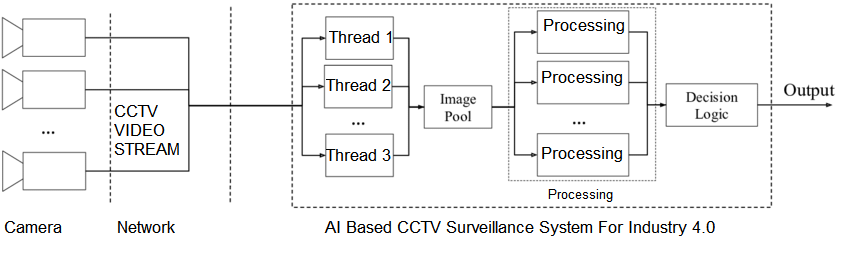
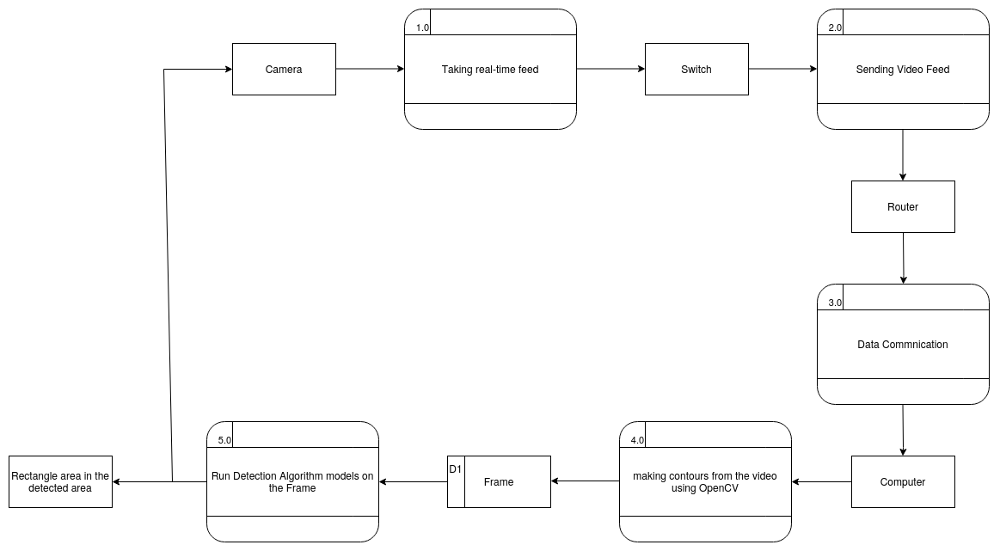
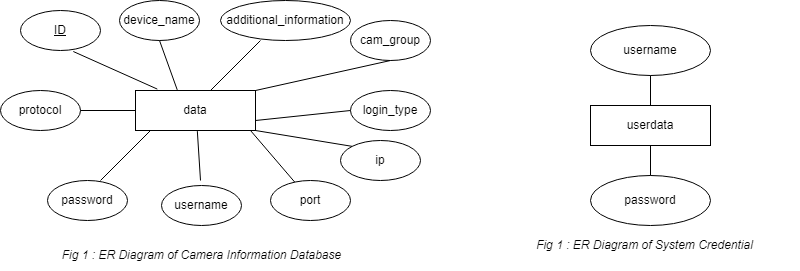
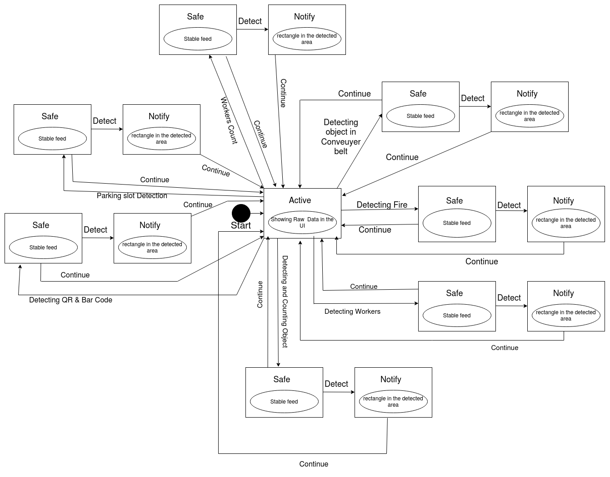

# Xenosys-Lab_BRACU
The codes and files for Brain Station 23 Hackathon

```
$ pip install -r requirements.txt
```

# System Design & Planning & Idea Assesment
### Use Case Diagram

### Swimlane Diagram

### Block Diagram

### Data Flow Diagram

### ER Diagram

### State Diagram


# User Interface
### Spalsh Screen

### Home Screen

### Live View- Normal Screen

### Live View - AI Analytics

### Sub Screen of Stream

### Grid Screen

### Device Manager Screen

